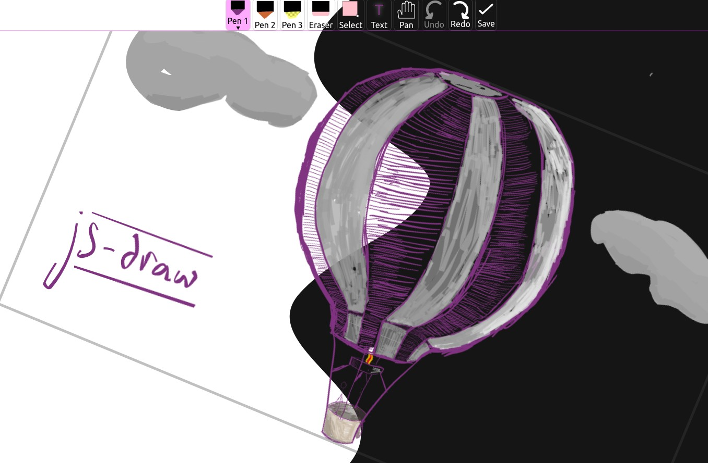

<div align="center">
    
</div>

<h1 align="center">js-draw</h1>
<div align="center">

[NPM package](https://www.npmjs.com/package/js-draw) | [GitHub](https://github.com/personalizedrefrigerator/js-draw) | [Documentation](https://personalizedrefrigerator.github.io/js-draw/typedoc/modules/js_draw.html) | [Try it!](https://personalizedrefrigerator.github.io/js-draw/example/example.html)

</div>



For example usage, see [one of the examples](https://github.com/personalizedrefrigerator/js-draw/blob/main/docs/examples.md) or read [the documentation](https://personalizedrefrigerator.github.io/js-draw/typedoc/).

If you're coming from version 0.25, [read the migration guide!](https://js-draw.web.app/typedoc/modules/Additional_Documentation.MigratingToVersion1__.html)

# API

To use `js-draw`,

## Creating an `Editor`

### With a bundler that supports importing `.css` files

To create a new `Editor` and add it as a child of `document.body`,
```ts
import Editor from 'js-draw';
import 'js-draw/styles';

const editor = new Editor(document.body);
```

The `import js-draw/styles` step requires a bundler that can import `.css` files. For example, [`webpack` with `css-loader`.](https://webpack.js.org/loaders/css-loader/)

### With a bundler that doesn't support importing `.css` files

Import the pre-bundled version of the editor to apply CSS after loading the page.
```ts
import Editor from 'js-draw';
import 'js-draw/bundledStyles';

const editor = new Editor(document.body);
```
`js-draw/bundledStyles` is a version of the editor's stylesheets pre-processed by `Webpack`. As such, `import`ing or including it with a `<script src="..."></script>` tag applies editor-specific CSS to the document.

### Without a bundler

If you're not using a bundler, consider using the pre-bundled editor:
```html
<!-- Replace 1.0.0 with the latest version of js-draw -->
<script src="https://cdn.jsdelivr.net/npm/js-draw@1.0.0/dist/bundle.js"></script>
<script>
    const editor = new jsdraw.Editor(document.body);
    editor.addToolbar();
    editor.getRootElement().style.height = '600px';
</script>
```

**Note**: To ensure the CDN-hosted version of `js-draw` hasn't been tampered with, consider [including an `integrity="..."` attribute](https://developer.mozilla.org/en-US/docs/Web/Security/Subresource_Integrity). [Read more about using SRI with JSDelivr](https://www.jsdelivr.com/using-sri-with-dynamic-files).


## Adding a toolbar

To create a toolbar with the default tools:
```ts
const toolbar = editor.addToolbar();
```

Save and exit buttons can be added with the `.addSaveButton` and `.addExitButton` methods: 
```ts
toolbar.addSaveButton(() => {
    const svgElem = editor.toSVG();
    console.log('The saved SVG:', svgElem.outerHTML);
});

toolbar.addExitButton(() => {
    // Save here?

    // Removes the editor from the document.
    editor.remove();
});
```

Custom actions can also be added to the toolbar. For example,
```ts
toolbar.addActionButton('Custom', () => {
    // When the action button is pressed
});
```
or alternatively, with an icon,
```ts
toolbar.addActionButton({
  label: 'Custom',
  icon: editor.icons.makeSaveIcon(),
}, () => {
    // Do something here
});
```

## Loading from an SVG

```ts
editor.loadFromSVG(`
    <svg
        viewBox="156 74 200 150"
        width="200" height="150"
    >
        <path d="M156,150Q190,190 209,217L213,215Q193,187 160,148M209,217Q212,218 236,178L232,176Q210,215 213,215M236,178Q240,171 307,95L305,93Q237,168 232,176M307,95Q312,90 329,78L327,74Q309,87 305,93" fill="#07a837"></path>
    </svg>
`);
```

**Note**: While `js-draw` supports a small subset of the SVG markup language, it tries to preserve unrecognised SVG elements.

For example, although `js-draw` doesn't support `<circle/>` elements,
```xml
<svg
    viewBox="156 74 200 150"
    width="200" height="150"
>
    <path d="M156,150Q190,190 209,217L213,215Q193,187 160,148M209,217Q212,218 236,178L232,176Q210,215 213,215M236,178Q240,171 307,95L305,93Q237,168 232,176M307,95Q312,90 329,78L327,74Q309,87 305,93" fill="#07a837"></path>
    <circle cx=200 cy=100 r=40 fill='red'/>
</svg>
```
renders as


but exports to
```xml
<svg viewBox="156 74 200 150" width="200" height="150" version="1.1" baseProfile="full" xmlns="http://www.w3.org/2000/svg"><g><path d="M156,150M156,150Q190,190 209,217L213,215Q193,187 160,148M209,217M209,217Q212,218 236,178L232,176Q210,215 213,215M236,178M236,178Q240,171 307,95L305,93Q237,168 232,176M307,95M307,95Q312,90 329,78L327,74Q309,87 305,93" fill="#07a837"></path></g><circle cx="200" cy="100" r="40" fill="red"></circle></svg>
```

which **does** contain the `<circle/>` element.

## Settings/configuration
### Disabling touchpad panning

Touchpad/mousewheel pan gestures can conflict with gestures used to scroll the document. To turn off touchpad pan gestures (and scrolling the editor with the mousewheel),
```ts
const editor = new Editor(document.body, {
    wheelEventsEnabled: false,
});
```

Alternatively, to only enable touchpad panning when the editor has focus,
```ts
const editor = new Editor(document.body, {
    wheelEventsEnabled: 'only-if-focused',
});
```

### Localization

If a user's language is available in [src/localizations/](src/localizations/) (as determined by `navigator.languages`), that localization will be used.

To override the default language, use `getLocalizationTable([ 'custom locale here' ])`. For example,
```ts
const editor = new Editor(document.body, {
    // Force the Spanish (Español) localizaiton
    localization: getLocalizationTable([ 'es' ]),
});
```

<details><summary>Creating a custom localization</summary>

See [src/localization.ts](src/localization.ts) for a list of strings that can be translated.

Many of the default strings in the editor might be overridden like this:
```ts
const editor = new Editor(document.body, {
    // Example partial Spanish localization
    localization: {
        // Not all translated strings need to be specified. If a string isn't given,
        // the English (default) localization will be used

        // Strings for the main editor interface
        // (see src/localization.ts)
        loading: (percentage: number) => `Cargando: ${percentage}%...`,
        imageEditor: 'Editor de dibujos',

        undoAnnouncement: (commandDescription: string) => `${commandDescription} fue deshecho`,
        redoAnnouncement: (commandDescription: string) => `${commandDescription} fue rehecho`,

        // Strings for the toolbar
        // (see src/toolbar/localization.ts)
        pen: 'Lapiz',
        eraser: 'Borrador',
        select: 'Selecciona',
        thicknessLabel: 'Tamaño: ',
        colorLabel: 'Color',

        ...
    },
});
```

</details>

## Changing the editor's color theme

The editor's color theme is specified using CSS. Its default theme looks like this:
```css
.imageEditorContainer {
    /* Deafult colors for the editor -- light mode */

    /* Used for unselected buttons and dialog text. */
    --background-color-1: white;
    --foreground-color-1: black;

    /* Used for some menu/toolbar backgrounds. */
    --background-color-2: #f5f5f5;
    --foreground-color-2: #2c303a;

    /* Used for other menu/toolbar backgrounds. */
    --background-color-3: #e5e5e5;
    --foreground-color-3: #1c202a;

    /* Used for selected buttons. */
    --selection-background-color: #cbdaf1;
    --selection-foreground-color: #2c303a;

    /* Used for dialog backgrounds */
    --background-color-transparent: rgba(105, 100, 100, 0.5);

    /* Used for shadows */
    --shadow-color: rgba(0, 0, 0, 0.5);

    /* Color used for some button/input foregrounds */
    --primary-action-foreground-color: #15b;
}

@media (prefers-color-scheme: dark) {
    .imageEditorContainer {
        /* Default colors for the editor -- dark mode */
        --background-color-1: #151515;
        --foreground-color-1: white;

        --background-color-2: #222;
        --foreground-color-2: #efefef;

        --background-color-3: #272627;
        --foreground-color-3: #eee;

        --selection-background-color: #607;
        --selection-foreground-color: white;
        --shadow-color: rgba(250, 250, 250, 0.5);
        --background-color-transparent: rgba(50, 50, 50, 0.5);

        --primary-action-foreground-color: #7ae;
    }
}
```

To override it, use a more specific CSS selector to set the theme variables. For example,
```css
/* Notice the "body" below -- the selector needs to be more specific than what's in js-draw */
body .imageEditorContainer {
    --background-color-1: green;
    --foreground-color-1: black;

    /* For this theme, use the same secondary and tertiary colors
       (it's okay for them to be the same). */
    --background-color-2: lime;
    --foreground-color-2: black;
    --background-color-3: lime;
    --foreground-color-3: black;

    --background-color-transparent: rgba(255, 240, 200, 0.5);
    --shadow-color: rgba(0, 0, 0, 0.5);

    --selection-background-color: yellow;
    --selection-foreground-color: black;
}
```
disables the dark theme and creates a theme that primarily uses yellow/green colors.

