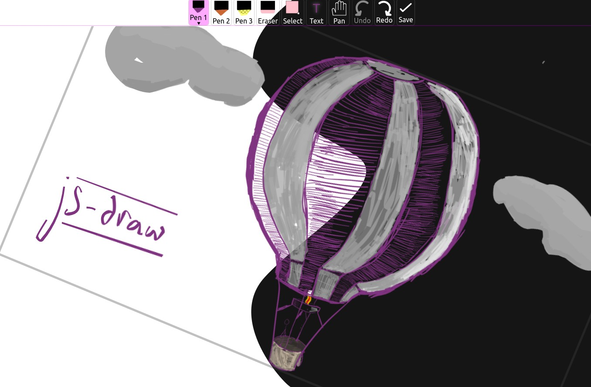

# js-draw

[NPM package](https://www.npmjs.com/package/js-draw) | [GitHub](https://github.com/personalizedrefrigerator/js-draw) | [Try it!](https://personalizedrefrigerator.github.io/js-draw/example/example.html)



For example usage, see [docs/example/example.ts](docs/example/example.ts).

# API

To use `js-draw`, 

## Creating an `Editor`

### With a bundler that supports importing `.css` files
To create a new `Editor` and add it as a child of `document.body`,
```ts
import Editor from 'js-draw';
import 'js-draw/styles';

const editor = new Editor(document.body);
```

The `import js-draw/styles` step requires a bundler that can import `.css` files. For example, [`webpack` with `css-loader`.](https://webpack.js.org/loaders/css-loader/)

### With a bundler that doesn't support importing `.css` files
Import the pre-bundled version of the editor to apply CSS after loading the page.
```ts
import Editor from 'js-draw';
import 'js-draw/bundle';

const editor = new Editor(document.body);
```
`js-draw/bundle` is a version of the editor pre-processed by `Webpack`. As such, `import`ing it applies editor-specific CSS to the document.

### Without a bundler
If you're not using a bundler, consider using the pre-bundled editor:
```html
<!-- Replace 0.1.2 with the latest version of js-draw -->
<script src="https://cdn.jsdelivr.net/npm/js-draw@0.1.2/dist/bundle.js"></script>
<script>
    const editor = new jsdraw.Editor(document.body);
    editor.addToolbar();
    editor.getRootElement().style.height = '600px';
</script>
```

**Note**: To ensure the CDN-hosted version of `js-draw` hasn't been tampered with, consider [including an `integrity="..."` attribute](https://developer.mozilla.org/en-US/docs/Web/Security/Subresource_Integrity). [Read more about using SRI with JSDelivr](https://www.jsdelivr.com/using-sri-with-dynamic-files).


## Adding a toolbar

To create a toolbar with the default tools:
```ts
const toolbar = editor.addToolbar();
```

Custom actions can be added to the toolbar. For example, to add a `save` button:
```ts
toolbar.addActionButton('Save', () => {
    const svgElem = editor.toSVG();
    console.log('The saved SVG:', svgElem.outerHTML);
});
```

## Loading from an SVG

```ts
editor.loadFromSVG(`
    <svg
        viewBox="156 74 200 150"
        width="200" height="150"
    >
        <path d="M156,150Q190,190 209,217L213,215Q193,187 160,148M209,217Q212,218 236,178L232,176Q210,215 213,215M236,178Q240,171 307,95L305,93Q237,168 232,176M307,95Q312,90 329,78L327,74Q309,87 305,93" fill="#07a837"></path>
    </svg>
`);
```

**Note**: While `js-draw` supports a small subset of the SVG markup language, it tries to preserve unrecognised SVG elements.

For example, although `js-draw` doesn't support `<circle/>` elements,
```svg
<svg
    viewBox="156 74 200 150"
    width="200" height="150"
>
    <path d="M156,150Q190,190 209,217L213,215Q193,187 160,148M209,217Q212,218 236,178L232,176Q210,215 213,215M236,178Q240,171 307,95L305,93Q237,168 232,176M307,95Q312,90 329,78L327,74Q309,87 305,93" fill="#07a837"></path>
    <circle cx=200 cy=100 r=40 fill='red'/>
</svg>
```
renders as


but exports to 
```svg
<svg viewBox="156 74 200 150" width="200" height="150" version="1.1" baseProfile="full" xmlns="http://www.w3.org/2000/svg"><g><path d="M156,150M156,150Q190,190 209,217L213,215Q193,187 160,148M209,217M209,217Q212,218 236,178L232,176Q210,215 213,215M236,178M236,178Q240,171 307,95L305,93Q237,168 232,176M307,95M307,95Q312,90 329,78L327,74Q309,87 305,93" fill="#07a837"></path></g><circle cx="200" cy="100" r="40" fill="red"></circle></svg>
```

which **does** contain the `<circle/>` element.

## Settings/configuration
### Disabling touchpad panning

Touchpad/mousewheel pan gestures can conflict with gestures used to scroll the document. To turn off touchpad pan gestures (and scrolling the editor with the mousewheel),
```ts
const editor = new Editor(document.body, {
    wheelEventsEnabled: false,
});
```

### Localization

See [src/localization.ts](src/localization.ts) for a list of strings.

Some of the default strings in the editor might be overridden like this:
```ts
const editor = new Editor(document.body, {
    // Example partial Spanish localization
    localization: {
        // Not all translated strings need to be specified. If a string isn't given,
        // the English (default) localization will be used

        // Strings for the main editor interface
        // (see src/localization.ts)
        loading: (percentage: number) => `Cargando: ${percentage}%...`,
        imageEditor: 'Editor de dibujos',

        undoAnnouncement: (commandDescription: string) => `${commandDescription} fue deshecho`,
        redoAnnouncement: (commandDescription: string) => `${commandDescription} fue rehecho`,

        // Strings for the toolbar
        // (see src/toolbar/localization.ts)
        pen: 'Lapiz',
        eraser: 'Borrador',
        select: 'Selecciona',
        touchDrawing: 'Dibuja con un dedo',
        thicknessLabel: 'Tamaño: ',
        colorLabel: 'Color: ',
        
        ...
    },
});
```


## Changing the editor's color theme

The editor's color theme is specified using CSS. Its default theme looks like this:
```css
.imageEditorContainer {
	/* Deafult colors for the editor -- light mode */

    --primary-background-color: white;
    --primary-background-color-transparent: rgba(255, 255, 255, 0.5);
    --secondary-background-color: #faf;
    --primary-foreground-color: black;
    --secondary-foreground-color: black;
}

@media (prefers-color-scheme: dark) {
	.imageEditorContainer {
		/* Deafult colors for the editor -- dark mode */

		--primary-background-color: #151515;
		--primary-background-color-transparent: rgba(50, 50, 50, 0.5);
		--secondary-background-color: #607;
		--primary-foreground-color: white;
		--secondary-foreground-color: white;
	}
}
```

To override it, use a more specific CSS selector to set the theme variables. For example,
```css
body .imageEditorContainer {
    --primary-background-color: green;
    --primary-background-color-transparent: rgba(255, 240, 200, 0.5);
    --secondary-background-color: yellow;
    --primary-foreground-color: black;
    --secondary-foreground-color: black;
}
```
disables the dark theme and creates a theme that primarially uses yellow/green colors.
