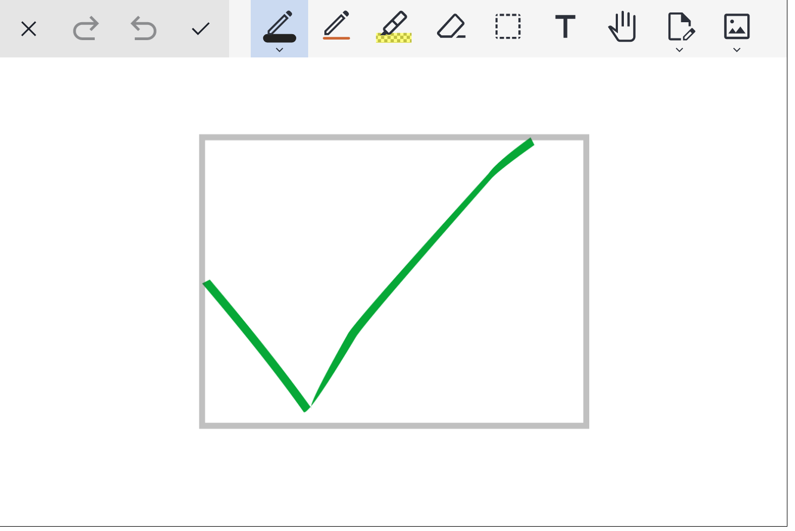

<div align="center">
    
</div>

<h1 align="center">js-draw</h1>
<div align="center">

[NPM package](https://www.npmjs.com/package/js-draw) | [GitHub](https://github.com/personalizedrefrigerator/js-draw) | [Documentation](https://personalizedrefrigerator.github.io/js-draw/typedoc/modules/js-draw.html) | [Try it!](https://personalizedrefrigerator.github.io/js-draw/example/example.html)

</div>


For example usage, see [one of the examples](https://github.com/personalizedrefrigerator/js-draw/blob/main/docs/examples.md) or read [the documentation](https://personalizedrefrigerator.github.io/js-draw/typedoc/).

# Features

## Very large zoom range

A core feature of `js-draw` is its [large zoom range](https://personalizedrefrigerator.github.io/js-draw/typedoc/interfaces/js-draw.EditorSettings.html#maxZoom) (from roughly 10⁻¹⁰x to 10¹⁰x).

<details open><summary><strong>Demo</strong></summary>

<video src="https://github.com/personalizedrefrigerator/js-draw/assets/46334387/f1c4afea-d7c8-4c36-835b-e01f2a646424" alt="Video: Shows zooming out further and further" controls></video>

</details>

Applications using `js-draw` can adjust this zoom range with custom [EditorSettings](https://personalizedrefrigerator.github.io/js-draw/typedoc/interfaces/js-draw.EditorSettings.html).

## Touchscreen and stylus support

`js-draw` supports touchscreen pinch zoom and rotate gestures. To simplify editing, screen rotation snaps to multiples of 90 degrees.

<details><summary><strong>Demo</strong></summary>
    
<video src="https://github.com/personalizedrefrigerator/js-draw/assets/46334387/1f4ebeb1-9d2f-4884-9410-9fb1d5e455ee" alt="Video: Shows canvas being rotated" controls></video>

</details>

It's also possible to disable touch drawing. This can be useful when drawing with a stylus and can be done with either [PanZoomTool.setMode](https://personalizedrefrigerator.github.io/js-draw/typedoc/classes/js-draw.PanZoomTool.html#setMode) or, by a user, with the "hand" tool menu:


## User-configurable tools

With the default toolbar, users can change the pen style, color, and more:


It's possible for applications using `js-draw` to [add custom pen types](https://personalizedrefrigerator.github.io/js-draw/typedoc/modules/Additional_Documentation.CustomizingTools__.html) that can also be customized in this way. It's also possible to [save the toolbar state](https://github.com/personalizedrefrigerator/js-draw/blob/main/docs/examples/example-save-restore-toolbar-state/example.ts) and restore it after reloading the app.

## More features

`js-draw` also supports:

- <details><summary>Partial stroke erasing</summary>

  <video src="https://github.com/personalizedrefrigerator/js-draw/assets/46334387/c8c2b8d5-5537-4df8-a8b5-899c2d7ea5ce"></video>

  </details>

- [Collaborative editing](https://github.com/personalizedrefrigerator/js-draw/tree/main/docs/examples/example-collaborative)
- Saving to and loading from a subset of SVG

# API

## Creating an `Editor`

### With a bundler that supports importing `.css` files

To create a new `Editor` and add it as a child of `document.body`, use the [Editor](https://personalizedrefrigerator.github.io/js-draw/typedoc/classes/js-draw.Editor.html#constructor) constructor:

```ts
import Editor from 'js-draw';
import 'js-draw/styles';

const editor = new Editor(document.body);
```

The `import js-draw/styles` step requires a bundler that can import `.css` files. For example, [`webpack` with `css-loader`.](https://webpack.js.org/loaders/css-loader/)

### With a bundler that doesn't support importing `.css` files

Import the pre-bundled version of the editor to apply CSS after loading the page.

```ts
import Editor from 'js-draw';
import 'js-draw/bundledStyles';

const editor = new Editor(document.body);
```

`js-draw/bundledStyles` is a version of the editor's stylesheets pre-processed by `es-build`. As such, `import`ing or including it with a `<script src="..."></script>` tag applies editor-specific CSS to the document.

### Without a bundler

If you're not using a bundler, consider using the pre-bundled editor:

```html
<!-- Replace 1.0.0 with the latest version of js-draw -->
<script src="https://cdn.jsdelivr.net/npm/js-draw@1.0.0/dist/bundle.js"></script>
<script>
  const editor = new jsdraw.Editor(document.body);
  editor.addToolbar();
  editor.getRootElement().style.height = '600px';
</script>
```

**Note**: To ensure the CDN-hosted version of `js-draw` hasn't been tampered with, consider [including an `integrity="..."` attribute](https://developer.mozilla.org/en-US/docs/Web/Security/Subresource_Integrity). [Read more about using SRI with JSDelivr](https://www.jsdelivr.com/using-sri-with-dynamic-files).

## Adding a toolbar

To create a toolbar with buttons for the default tools:

```ts
const toolbar = editor.addToolbar();
```

Save and exit buttons can be added with the [`.addSaveButton`](https://personalizedrefrigerator.github.io/js-draw/typedoc/classes/js-draw.AbstractToolbar.html#addSaveButton) and [`.addExitButton`](https://personalizedrefrigerator.github.io/js-draw/typedoc/classes/js-draw.AbstractToolbar.html#addExitButton) methods:

```ts
toolbar.addSaveButton(() => {
  const svgElem = editor.toSVG();
  console.log('The saved SVG:', svgElem.outerHTML);
});

toolbar.addExitButton(() => {
  // Save here?

  // Removes the editor from the document.
  editor.remove();
});
```

Custom actions can also be added to the toolbar. For example,

```ts
toolbar.addActionButton('Custom', () => {
  // When the action button is pressed
});
```

or alternatively, with an icon,

```ts
toolbar.addActionButton(
  {
    label: 'Custom',
    icon: editor.icons.makeSaveIcon(),
  },
  () => {
    // Do something here
  },
);
```

## Loading from SVG

```ts
editor.loadFromSVG(`
    <svg
        viewBox="156 74 200 150"
        width="200" height="150"
    >
        <path d="M156,150Q190,190 209,217L213,215Q193,187 160,148M209,217Q212,218 236,178L232,176Q210,215 213,215M236,178Q240,171 307,95L305,93Q237,168 232,176M307,95Q312,90 329,78L327,74Q309,87 305,93" fill="#07a837"></path>
    </svg>
`);
```

**Note**: While `js-draw` supports only a small subset of the SVG markup language, it tries to preserve unrecognised SVG elements.

For example, although `js-draw` doesn't support `<circle/>` elements,

```xml
<svg
    viewBox="156 74 200 150"
    width="200" height="150"
>
    <path d="M156,150Q190,190 209,217L213,215Q193,187 160,148M209,217Q212,218 236,178L232,176Q210,215 213,215M236,178Q240,171 307,95L305,93Q237,168 232,176M307,95Q312,90 329,78L327,74Q309,87 305,93" fill="#07a837"></path>
    <circle cx=200 cy=100 r=40 fill='red'/>
</svg>
```

renders as



but exports to

```xml
<svg viewBox="156 74 200 150" width="200" height="150" version="1.1" baseProfile="full" xmlns="http://www.w3.org/2000/svg"><g><path d="M156,150M156,150Q190,190 209,217L213,215Q193,187 160,148M209,217M209,217Q212,218 236,178L232,176Q210,215 213,215M236,178M236,178Q240,171 307,95L305,93Q237,168 232,176M307,95M307,95Q312,90 329,78L327,74Q309,87 305,93" fill="#07a837"></path></g><circle cx="200" cy="100" r="40" fill="red"></circle></svg>
```

which **does** contain the `<circle/>` element.

## Customizing the background

The background color and style can be customized with [editor.setBackgroundStyle](https://personalizedrefrigerator.github.io/js-draw/typedoc/classes/js-draw.Editor.html#setBackgroundStyle). For example,

```ts
import { Editor, Color4, BackgroundComponentBackgroundType } from 'js-draw';
const editor = new Editor(document.body);

editor.dispatch(
  editor.setBackgroundStyle({
    color: Color4.orange,
    type: BackgroundComponentBackgroundType.Grid,
  }),
);
```

Above, we use `editor.dispatch` because `setBackgroundStyle` returns a [`Command`](https://personalizedrefrigerator.github.io/js-draw/typedoc/classes/js-draw.Command.html), rather than changing the background style directly. `js-draw` uses `Command`s to track actions that can be undone and redone.

By default, `.dispatch` adds `Command`s to the undo stack. To avoid this, pass `false` for the second parameter to [`.dispatch`](https://personalizedrefrigerator.github.io/js-draw/typedoc/classes/js-draw.Editor.html#dispatch):

```ts
const addToHistory = false;
editor.dispatch(
  editor.setBackgroundStyle({
    color: Color4.orange,
    type: BackgroundComponentBackgroundType.Grid,
  }),
  addToHistory,
);
```

### Making the background fill the screen

By default, the background has a fixed size and marks the region that will be saved by [`.toSVG`](https://personalizedrefrigerator.github.io/js-draw/typedoc/classes/js-draw.Editor.html#toSVG) or [`.toDataURL`](https://personalizedrefrigerator.github.io/js-draw/typedoc/classes/js-draw.Editor.html#toDataURL). It's possible to make the background auto-resize to the content of the image with [`editor.image.setAutoresizeEnabled(true)`](https://personalizedrefrigerator.github.io/js-draw/typedoc/classes/js-draw.EditorImage.html#setAutoresizeEnabled):

```ts
const editor = new Editor(document.body);

const addToHistory = false;
editor.dispatch(editor.image.setAutoresizeEnabled(true), addToHistory);

// Alternatively, using .setBackgroundStyle:
editor.dispatch(editor.setBackgroundStyle({ autoresize: true }), addToHistory);
```

## Saving

To save as an SVG, use [`editor.toSVG()`](https://personalizedrefrigerator.github.io/js-draw/typedoc/classes/js-draw.Editor.html#toSVG), which returns an `HTMLSVGElement`. Alternatively, if working with very large images that need to be saved in the background, consider using [`editor.toSVGAsync()`](https://personalizedrefrigerator.github.io/js-draw/typedoc/classes/js-draw.Editor.html#toSVG).

It's also possible to render the editor to a PNG or JPEG data URL. This can be done with [`editor.toDataURL()`](https://personalizedrefrigerator.github.io/js-draw/typedoc/classes/js-draw.Editor.html#toDataURL).

The region of the image that will be saved can be changed by calling [`editor.image.setImportExportRect`](https://personalizedrefrigerator.github.io/js-draw/typedoc/classes/js-draw.Editor.html#setImportExportRect) or

## Settings/configuration

### Disabling touchpad panning

Touchpad/mousewheel pan gestures can conflict with gestures used to scroll the document. To turn off touchpad pan gestures (and scrolling the editor with the mousewheel),

```ts
const editor = new Editor(document.body, {
  wheelEventsEnabled: false,
});
```

Alternatively, to only enable touchpad panning when the editor has focus,

```ts
const editor = new Editor(document.body, {
  wheelEventsEnabled: 'only-if-focused',
});
```

### Localization

If a user's language is available in [src/localizations/](packages/js-draw/src/localizations) (as determined by `navigator.languages`), that localization will be used.

To override the default language, use `getLocalizationTable([ 'custom locale here' ])`. For example,

```ts
const editor = new Editor(document.body, {
  // Force the Spanish (Español) localizaiton
  localization: getLocalizationTable(['es']),
});
```

<details><summary>Creating a custom localization</summary>

See [src/localization.ts](packages/js-draw/src/localization.ts) for a list of strings that can be translated.

Many of the default strings in the editor might be overridden like this:

```ts
const editor = new Editor(document.body, {
    // Example partial Spanish localization
    localization: {
        // Not all translated strings need to be specified. If a string isn't given,
        // the English (default) localization will be used

        // Strings for the main editor interface
        // (see packages/js-draw/src/localization.ts)
        loading: (percentage: number) => `Cargando: ${percentage}%...`,
        imageEditor: 'Editor de dibujos',

        undoAnnouncement: (commandDescription: string) => `${commandDescription} fue deshecho`,
        redoAnnouncement: (commandDescription: string) => `${commandDescription} fue rehecho`,

        // Strings for the toolbar
        // (see src/toolbar/localization.ts)
        pen: 'Lapiz',
        eraser: 'Borrador',
        select: 'Selecciona',
        thicknessLabel: 'Tamaño: ',
        colorLabel: 'Color',

        ...
    },
});
```

</details>

### Setting the minimum and maximum zoom

By default, the editor's minimum and maximum zoom are very large (2·10<sup>-10</sup>x and 10<sup>12</sup>x, respectively). These are configurable by the `minZoom` and `maxZoom` settings. For example,

```ts
const editor = new Editor(document.body, {
  minZoom: 0.5,
  maxZoom: 2,
});
```

## Changing the editor's color theme

The editor's color theme is specified using CSS. Its default theme looks like this:

```css
.imageEditorContainer {
  /* Deafult colors for the editor -- light mode */

  /* Used for unselected buttons and dialog text. */
  --background-color-1: white;
  --foreground-color-1: black;

  /* Used for some menu/toolbar backgrounds. */
  --background-color-2: #f5f5f5;
  --foreground-color-2: #2c303a;

  /* Used for other menu/toolbar backgrounds. */
  --background-color-3: #e5e5e5;
  --foreground-color-3: #1c202a;

  /* Used for selected buttons. */
  --selection-background-color: #cbdaf1;
  --selection-foreground-color: #2c303a;

  /* Used for dialog backgrounds */
  --background-color-transparent: rgba(105, 100, 100, 0.5);

  /* Used for shadows */
  --shadow-color: rgba(0, 0, 0, 0.5);

  /* Color used for some button/input foregrounds */
  --primary-action-foreground-color: #15b;
}

@media (prefers-color-scheme: dark) {
  .imageEditorContainer {
    /* Default colors for the editor -- dark mode */
    --background-color-1: #151515;
    --foreground-color-1: white;

    --background-color-2: #222;
    --foreground-color-2: #efefef;

    --background-color-3: #272627;
    --foreground-color-3: #eee;

    --selection-background-color: #607;
    --selection-foreground-color: white;
    --shadow-color: rgba(250, 250, 250, 0.5);
    --background-color-transparent: rgba(50, 50, 50, 0.5);

    --primary-action-foreground-color: #7ae;
  }
}
```

To override it, use a more specific CSS selector to set the theme variables. For example,

```css
/* Notice the "body" below -- the selector needs to be more specific than what's in js-draw */
body .imageEditorContainer {
  --background-color-1: green;
  --foreground-color-1: black;

  /* For this theme, use the same secondary and tertiary colors
       (it's okay for them to be the same). */
  --background-color-2: lime;
  --foreground-color-2: black;
  --background-color-3: lime;
  --foreground-color-3: black;

  --background-color-transparent: rgba(255, 240, 200, 0.5);
  --shadow-color: rgba(0, 0, 0, 0.5);

  --selection-background-color: yellow;
  --selection-foreground-color: black;
}
```

disables the dark theme and creates a theme that primarily uses yellow/green colors.

See also [adjustEditorThemeForContrast](https://personalizedrefrigerator.github.io/js-draw/typedoc/functions/js-draw.adjustEditorThemeForContrast.html).

# Examples and resources

- [Examples](https://github.com/personalizedrefrigerator/js-draw/blob/main/docs/examples.md)
- [How to add a custom pen type](https://personalizedrefrigerator.github.io/js-draw/typedoc/modules/Additional_Documentation.CustomizingTools__.html#md:adding-a-new-pen-type)
- [A material icon theme for js-draw](https://personalizedrefrigerator.github.io/js-draw/typedoc/modules/_js-draw_material-icons.html#md:js-drawmaterial-icons)
- [More documentation](https://personalizedrefrigerator.github.io/js-draw/typedoc/modules/Guides.html)
